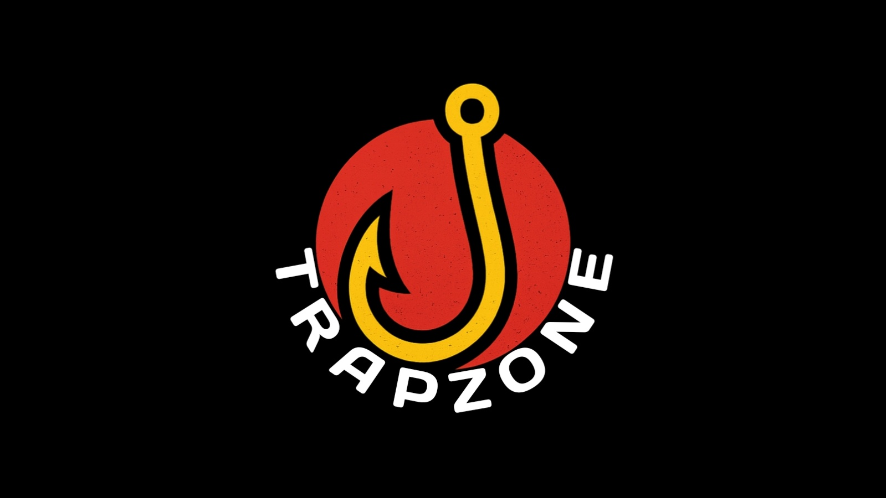

<p align="center">
  
</p>
<p align="center">
  
  
  
  
  
  
  
  
  <a href="https://github.com/KalloloCoder">
    
  </a>
</p>

# TrapZone - Cyber Security Simulation

TrapZone adalah **simulasi keamanan siber berbasis PHP** untuk mempelajari cara kerja phishing secara **aman** di server lokal.  
Proyek ini hanya untuk **edukasi** dan **latihan etis** dalam mengenali serangan phishing, **bukan untuk digunakan secara ilegal**.  

---

## Fitur
- CLI controller interaktif (pilih menu langsung dari terminal).
- 3 situs phishing dummy yang realistis:
  - Facebook
  - Instagram
  - Email
- Semua input login dummy otomatis tercatat ke log file dan bisa dipantau lewat CLI.
- Bisa dijalankan di **Termux (Android)**, **Linux**, maupun **Windows (PowerShell)**.

---

## Struktur Folder
```
TrapZone/
├── trapzone.php          # CLI Controller
├── includes/
│   ├── config.php        # Konfigurasi global
│   └── functions.php     # Fungsi utilitas
├── logs/
│   └── trapzone.log      # File log hasil input dummy
├── phishing_sites/
│   ├── facebook/         # Dummy Facebook
│   │   ├── index.php
│   │   └── style.css
│   ├── instagram/        # Dummy Instagram
│   │   ├── index.php
│   │   └── style.css
│   └── email/            # Dummy Email
│       ├── index.php
│       └── style.css
```

---

## Instalasi & Persiapan

### Termux (Android)
1. Install Termux versi terbaru dari [F-Droid](https://f-droid.org/en/packages/com.termux/).  
   (Jangan dari Play Store, karena versi di sana sudah deprecated dan bug preload library.)
2. Update & upgrade Termux:
   ```bash
   pkg update && pkg upgrade -y
   ```
3. Install PHP dan Git:
   ```bash
   pkg install php git -y
   ```
4. Clone repo TrapZone:
   ```bash
   git clone https://github.com/KalloloCoder/TrapZone.git
   cd TrapZone
   ```
5. Jalankan CLI TrapZone:
   ```bash
   php trapzone.php
   ```

 Jika muncul error `CANNOT LINK EXECUTABLE "sh": libtermux-exec-ld-preload.so ...` → ketik:
```bash
unset LD_PRELOAD
```
lalu jalankan ulang script.

---

### Linux (Ubuntu/Debian/Arch dll.)
1. Pastikan PHP sudah terinstall:
   ```bash
   php -v
   ```
   Kalau belum ada:
   ```bash
   sudo apt install php -y       # Ubuntu/Debian
   sudo pacman -S php --noconfirm # Arch
   ```
2. Clone repo TrapZone:
   ```bash
   git clone https://github.com/KalloloCoder/TrapZone.git
   cd TrapZone
   ```
3. Jalankan CLI:
   ```bash
   php trapzone.php
   ```

---

### Windows (PowerShell)
1. Install **PHP for Windows** dari [php.net](https://windows.php.net/download/).  
   Pastikan `php.exe` ditambahkan ke **PATH** (cek dengan `php -v` di PowerShell).
2. Download atau clone repo:
   ```powershell
   git clone https://github.com/KalloloCoder/TrapZone.git
   cd TrapZone
   ```
3. Jalankan CLI:
   ```powershell
   php trapzone.php
   ```

---

## Penggunaan
Setelah menjalankan:
```bash
php trapzone.php
```

Akan muncul menu:
```
[1] Start Local Server
[2] Show Phishing URLs
[3] Monitor Logs
[0] Exit
```

- **[1] Start Local Server** → Menyalakan server lokal di port 8080.  
  Server berjalan di:  
  ```
  http://127.0.0.1:8080/
  ```
- **[2] Show Phishing URLs** → Menampilkan link dummy:
  - `http://127.0.0.1:8080/phishing_sites/facebook/`
  - `http://127.0.0.1:8080/phishing_sites/instagram/`
  - `http://127.0.0.1:8080/phishing_sites/email/`
- **[3] Monitor Logs** → Melihat secara live input dummy user (username/password) yang masuk dari browser.  
- **[0] Exit** → Keluar & otomatis mematikan server.

---

## Catatan
- Gunakan hanya di **server lokal** (localhost/127.0.0.1).  
- **Jangan** pernah host TrapZone di server publik.  
- Hanya untuk pembelajaran & riset etis.  
- Apabila ada penyalahgunaan oleh pengguna, maka author tidak bertanggungjawab atas segala tindakan yang dilakukan pengguna.

---

## Author
Created by [**KalloloCoder**](https://github.com/KalloloCoder) 
